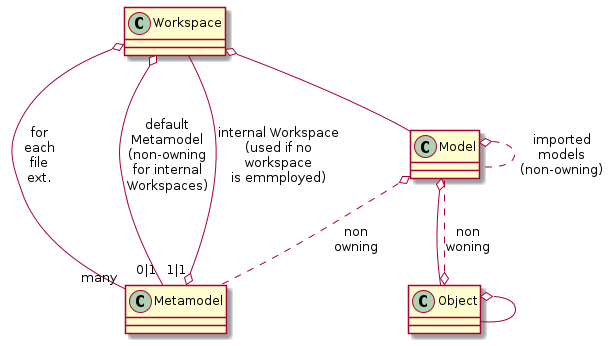

# textx-cpp

This is an interpreter for [textx](https://github.com/textX/textX) grammars written in C++. Check the [textx-docu](http://textx.github.io/textX/stable/) for a description of the grammar definition.
It still has some small limitations (see below, [open points](#openpoints) and [limitations](#limitations)), but many grammars can be parsed.
 * This is a just-for-fun project and a proof of concept...
 * You already get many/most textx-features, including
   * **basic grammar** with references and scoping
   * **multi file models** (importURI; see [test/multi_metamodel.t.cpp](test/multi_metamodel.t.cpp))
   * **multi meta models** (reference/include other meta models; see [test/multi_metamodel.t.cpp](test/multi_metamodel.t.cpp))
   * **RREL** for **easy scope providers** (defined inline in the grammar; see [test/rrel.t.cpp](test/rrel.t.cpp))
 * You also get
   * simple "**istrings**" (indented strings, motivated by XTend: not a full language like XTend, but a simple way to format small parts of your generated code with automatic indentation - just plug your model and some custom C++ functions into your string templates; see [test/istrings.t.cpp](test/istrings.t.cpp)) 
   * experimental **model json export** (see interactive [integration_tests/json_export](integration_tests/json_export))
 * Examples, see: 
   - [test/model.t.cpp](test/model.t.cpp)
   - [test/scoping.t.cpp](test/scoping.t.cpp)
   - [test/metamodel.t.cpp](test/metamodel.t.cpp)

```c++
  auto grammar1 = R"#(
      Model: shapes+=Shape[','];
      Shape: Point|Circle|Line;
      Point: 'Point' '(' x=NUMBER ',' y=NUMBER ')';
      Circle: 'Circle' '(' 
        center=Point
        ','
        r=NUMBER 
      ')';
      Line: 'Line' '(' 
        p1=Point
        ','
        p2=Point
      ')';
  )#";

  auto mm = textx::metamodel_from_str(grammar1);
  auto m = mm->model_from_str(R"(
      Point(1,2),
      Circle(Point(333,4.5),9),
      Line(Point(0,0),Point(1,1))
  )");

  CHECK( (*m)["shapes"].size() == 3 );
  CHECK( (*m)["shapes"][0].obj()->type == "Point" );
  CHECK( (*m)["shapes"][1].obj()->type == "Circle" );
  CHECK( (*m)["shapes"][1]["center"]["x"].i() == 333 );
  CHECK( (*m)["shapes"][2].obj()->type == "Line" );
```
## Meta model representation

The meta model (`textx::Metamodel`) allows to access its grammar rules by name: `mm["Name"]`.
Each rule (`textx::Rule`) holds the following information (see, e.g., `metamodel_with_obj_attributes_testing_multitype_info2_advanced_abstract_rules` in [test/metamodel.t.cpp](test/metamodel.t.cpp)):

 * the `RuleType type()`: `RuleType::common`, `RuleType::abstract`, `RuleType::match` (see [textx-docu](http://textx.github.io/textX/stable/)),
 * if it potentially results in a string (`bool maybe_str()`),
 * all attributes (`operator[](std::string)` or for-each).

Each Attribute represents either string, object or boolean values. Attributes can also represent lists (not in combination with booleans). Each Attribute can be queried (via `AttributeInfo`):

 * `is_str()`, `is_boolean()`, `is_obj()`: indicates if it has a *unique* output type defined by the grammar - this always implies `is_mulit_type()==false` (note: the member `type` of the `AttributeInfo` indicates the type/rule-name of the object in case of `is_obj()`/`maybe_obj()`).
 * `maybe_str()`, `maybe_boolean()`, `may_obj()`: indicates if it has a possible output type defined by the grammar.
 * `is_multi_type()` indicates if it has more than one possible output type defined by the grammar. 
 * the `cardinality` indicates if the attribute represents a `AttributeCardinality::scalar` or a `AttributeCardinality::list`.

## Model representation

The parsed model is represented as a `textx::Model` object. This model object allows
to access the model data.

Ownership:
 * The model allows to access to the underlying metamodel object (stored as a weak reference). 
 * The model allows to access imported model objects (imported with `importURI`; stored as a weak references). 
 * The workspace owns and caches all loaded models. In case you use no workspace, an internal default workspace of the Metamodel is employed.

 

The model value supports different access options:
 * query the value if it represents a certain type:
   * a string (`is_str()`)
   * an object = rule instance or a reference to an object (`is_obj()`)
   * an object, but no reference (`is_pure_obj()`)
   * a reference (`is_ref()`)
   * a boolean (`is_boolean()`)
   * a list (`is_list()`)
 * direct access through the `operator[]`:
   * object attribute access: `val["attr-name"]`
   * list access: `val[index]`
   * list size: `val.size()`
   * text: `str()` or text converted to numbers: `boolean()`, `i()`, `u()`, `f()`.
   * reference: `ref()`
   * object: `obj()`

Example:
```
   auto mm = textx::metamodel_from_str(R"#(
      Model: points+=Point[','];
      Point: "(" x=NUMBER "," y=NUMBER ")";
   )#");
   auto m1 = mm->model_from_str("(1,2), (3,4.5)");
   CHECK((*m1)["points"].size() == 2);
   CHECK((*m1)["points"][1]["x"].i() == 3);
   CHECK((*m1)["points"][1]["y"].str() == "4.5");
```

## Workspaces

Use workspaces to manage meta models and models:

Grammars:

**Type.tx**
```
Model: types+=Type;
Type: 'type' name=ID;
Comment: /\/\/.*?$/;
```

**Data.tx**
```
reference Types

Model: includes*=Include data+=Data;
Data: 'data' name=ID '{'
    attributes+=Attribute
'}';
Attribute: name=ID ':' type=[Types.Type|ID|+m:types];
Include: '#include' importURI=STRING;
Comment: /\/\/.*?$/;
```

**Flow.tx**
```
reference Data

Model: includes*=Include algos+=Algo flows+=Flow;
Algo: 'algo' name=ID ':' inp=[Data.Data|ID|+m:data] '->' outp=[Data.Data|ID|+m:data];
Flow: 'connect' algo1=[Algo|ID|+m:algos] '->' algo2=[Algo|ID|+m:algos] ;
Include: '#include' importURI=STRING;
Comment: /\/\/.*?$/;
```

Register all grammars in a workspace (see [`multi_metamodel.t.cpp`](test/multi_metamodel.t.cpp)):
```
auto workspace = textx::Workspace::create();
auto mm_fn_T = std::filesystem::path(__FILE__).parent_path().append("multi_metamodel/referenced_metamodel/Types.tx");
auto mm_fn_D = std::filesystem::path(__FILE__).parent_path().append("multi_metamodel/referenced_metamodel/Data.tx");
auto mm_fn_F = std::filesystem::path(__FILE__).parent_path().append("multi_metamodel/referenced_metamodel/Flow.tx");
workspace->add_metamodel_from_file_for_extension(".etype",mm_fn_T);
workspace->add_metamodel_from_file_for_extension(".edata",mm_fn_D);
workspace->add_metamodel_from_file_for_extension(".eflow",mm_fn_F);
```

Then load a model:
```
auto fn = std::filesystem::path(__FILE__).parent_path().append("multi_metamodel/referenced_metamodel/model/data_flow.eflow");
auto m = workspace->model_from_file(fn);
```

## Examples

In the [examples folder](examples) you find examples (some of them with unit tests).
E.g. have a look at [mgrep](examples/mgrep/README.md), a model driven version of grep.

## Implementation Details

 * arpeggio.h
    * Responsibility: basic parser functionality, inspirited by [Arpeggio](https://github.com/textX/Arpeggio).
    * Code config, arpeggio.h: `#define ARPEGGIO_USE_BOOST_FOR_REGEX` activates the boost version of regex; else the std-lib version is used. Since the boost is *much* faster, this define is introduced (+CMakeLists.txt adaptations).

 * assert.h
    * Responsibility: exceptions tools with information about model/file location.

 * grammar.h
    * Responsibility: container for rules and interface to trigger parsing.

 * lang.h
    * Responsibility: migration of [lang.py](https://github.com/textX/textX/blob/master/textx/lang.py)
      (the textx grammar language).

 * workspace.h
    * Responsibility: manages (owns) all meta models and models.
    * Allows to load meta models (from *.tx files) and to associate them to file endings.
    * Allows to load models (from registered file endings) using the appropriate
    meta model.

 * metamodel.h
    * Responsibility: extended user-grammar representation. Allows to load a model (inspired by metamodel.py). Prefer using the workspace for model loading.

 * model.h
    * Responsibility: 
      - user model representation (inspired by model.py).
      - user model parsing (inspired by model.py).

 * object.h
    * Responsibility: simple model representation tree (resides inside a textx::Model).

 * rule.h
    * Responsibility: textx user grammar rule representation (extends a simple textx::apreggio::Pattern with, e.g. attribute and attribute type information).

 * textx_grammar_parsetree.h
    * Responsibility: internal helper to parse user grammars.

## Dependencies

 * boost regex
   * faster than built-in regex
   * some special cases (unit tests) fail with the built-in regex

 * cppcoro (gcc compatible fork https://github.com/andreasbuhr/cppcoro)
   * for the `coro::generator<..>` required for the
   RREL implementation (breadth-first search).
## Links

 * Textx, Arpeggio, etc: [https://github.com/textX](https://github.com/textX)
 * Motivation for basic Arpeggio re-impl: [https://blog.bruce-hill.com/](https://blog.bruce-hill.com/packrat-parsing-from-scratch)
 * Coroutine tutorial [https://www.scs.stanford.edu/~dm/blog/c++-coroutines.html](https://www.scs.stanford.edu/~dm/blog/c++-coroutines.html) (useful for the RREL implementation)

## <a name="limitations"></a>Limitations compared to original textx (python)

Note: these limitation are not complete.

 * No global registration of languages.
 * Language references work slightly different:
   * You must reference a grammar name (the name of the language is the name of the main grammar of that language).
   * You cannot rename a referenced language (alias).
 * Some minor language details (e.g. the regex implementation has some small differences).
 * Some details are not yet implemented:
   * noskipws/skipws is not yet supported.
   * has_match_suppression is not yet supported.
* Be careful with greedy regexps for comments: in textx for python you can use the following for C++ like comments:
  ```
  Comment: /\/\/.*$/;
  ```
  In textx-cpp you need the non-greedy variant somehow:

  ```
  Comment: /\/\/.*?$/;
  ```

## <a name="openpoints"></a> Open Points
Prio 1:
 * add more unit tests / migrate tests / find bugs
 * include asan into cmake instead of using valgrind.

Prio 2:
 * analyze "coroutine effect" (see defines in rrel.cpp).
 * TODO minor: it must be possible for "eolterm" to be combined with a separator pattern
 * TODO: use has_match_suppression
 * TODO: rule parameters
 