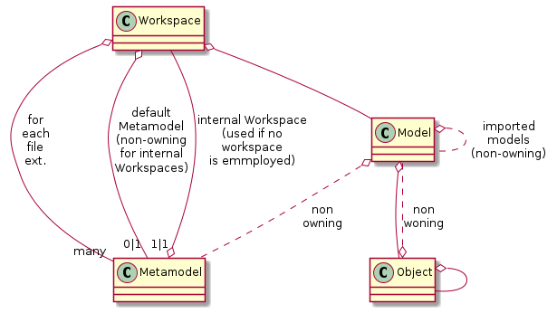

# textx-cpp

This is an interpreter for [textx](https://github.com/textX/textX) grammars written in C++.
It still has some limitations (see below, [open points](#openpoints)), but simple grammars can be parsed.
 * This is a just-for-fun project and a proof of concept...
 * Examples, see: 
   - [test/model.t.cpp](test/model.t.cpp)
   - [test/scoping.t.cpp](test/scoping.t.cpp)
   - [test/metamodel.t.cpp](test/metamodel.t.cpp)

```c++
  auto grammar1 = R"#(
      Model: shapes+=Shape[','];
      Shape: Point|Circle|Line;
      Point: 'Point' '(' x=NUMBER ',' y=NUMBER ')';
      Circle: 'Circle' '(' 
        center=Point
        ','
        r=NUMBER 
      ')';
      Line: 'Line' '(' 
        p1=Point
        ','
        p2=Point
      ')';
  )#";

  auto mm = textx::metamodel_from_str(grammar1);
  auto m = mm->model_from_str(R"(
      Point(1,2),
      Circle(Point(333,4.5),9),
      Line(Point(0,0),Point(1,1))
  )");

  CHECK( (*m)["shapes"].size() == 3 );
  CHECK( (*m)["shapes"][0].obj()->type == "Point" );
  CHECK( (*m)["shapes"][1].obj()->type == "Circle" );
  CHECK( (*m)["shapes"][1]["center"]["x"].i() == 333 );
  CHECK( (*m)["shapes"][2].obj()->type == "Line" );
```
## Model representation

The parsed model is represented as a `textx::Model` object. This model object allows
to access the model data.

Ownership:
 * The model allows to access to the underlying metamodel object (stored as a weak reference). 
 * The model allows to access imported model objects (imported with `importURI`; stored as a weak references). 
 * The workspace owns and caches all loaded models. In case you use no workspace, an internal default workspace of the Metamodel is employed.

 

The model value supports different access options:
 * query the value if it represents a certain type:
   * a string (`is_str()`)
   * an object = rule instance or a reference to an object (`is_obj()`)
   * an object, but no reference (`is_pure_obj()`)
   * a reference (`is_ref()`)
   * a boolean (`is_boolean()`)
   * a list (`is_list()`)
 * direct access through the `operator[]`:
   * object attribute access: `val["attr-name"]`
   * list access: `val[index]`
   * list size: `val.size()`
   * text: `str()` or text converted to numbers: `boolean()`, `i()`, `u()`, `f()`.
   * reference: `ref()`
   * object: `obj()`

Example:
```
   auto mm = textx::metamodel_from_str(R"#(
      Model: points+=Point[','];
      Point: "(" x=NUMBER "," y=NUMBER ")";
   )#");
   auto m1 = mm->model_from_str("(1,2), (3,4.5)");
   CHECK((*m1)["points"].size() == 2);
   CHECK((*m1)["points"][1]["x"].i() == 3);
   CHECK((*m1)["points"][1]["y"].str() == "4.5");
```

## Implementation Details

 * arpeggio.h
    * Responsibility: basic parser functionality, inspirited by [Arpeggio](https://github.com/textX/Arpeggio).
    * Code config, arpeggio.h: `#define ARPEGGIO_USE_BOOST_FOR_REGEX` activates the boost version of regex; else the std-lib version is used. Since the boost is *much* faster, this define is introduced (+CMakeLists.txt adaptations).

 * assert.h
    * Responsibility: exceptions tools with information about model/file location.

 * grammar.h
    * Responsibility: container for rules and interface to trigger parsing.

 * lang.h
    * Responsibility: migration of [lang.py](https://github.com/textX/textX/blob/master/textx/lang.py)
      (the textx grammar language).
 * metamodel.h
    * Responsibility: extended user-grammar representation. Allows to load a model (inspired by metamodel.py).

 * model.h
    * Responsibility: 
      - user model representation (inspired by model.py).
      - user model parsing (inspired by model.py).

 * object.h
    * Responsibility: simple model representation tree (resides inside a textx::Model).

 * rule.h
    * Responsibility: textx user grammar rule representation (extends a simple textx::apreggio::Pattern with, e.g. attribute and attribute type information).

 * textx_grammar_parsetree.h
    * Responsibility: internal helper to parse user grammars.

## Dependencies

 * boost regex
   * faster than built-in regex
   * some special cases (unittests) fail with the built-in regex

 * cppcoro (gcc compatible fork https://github.com/andreasbuhr/cppcoro)
   * for the `coro::generator<..>` required for the
   RREL implementation (breadth-first search).
## Links

 * Textx, Arpeggio, etc: [https://github.com/textX](https://github.com/textX)
 * Motivation for basic Arpeggio re-impl: [https://blog.bruce-hill.com/](https://blog.bruce-hill.com/packrat-parsing-from-scratch)
 * Coroutine tutorial [https://www.scs.stanford.edu/~dm/blog/c++-coroutines.html](https://www.scs.stanford.edu/~dm/blog/c++-coroutines.html) (useful for the RREL implementation)

## <a name="openpoints"></a> Open Points
Prio 1:
 * add more unittests / migrate tests / find bugs
 * include asan into cmake instead of using valgrind.

Prio 2:
 * analyze "coroutine effect" (see defines in rrel.cpp).
 * TODO minor: it must be possible for "eolterm" to be combined with a separator pattern
 * TODO: use has_match_suppression
 * TODO: rule parameters
 * "reference abc as xyz" is not supported ("as"/"alias"). You can only reference other Grammars (similar to importing - but referenced grammars must be loaded in the workspace prior to be referenced.)
